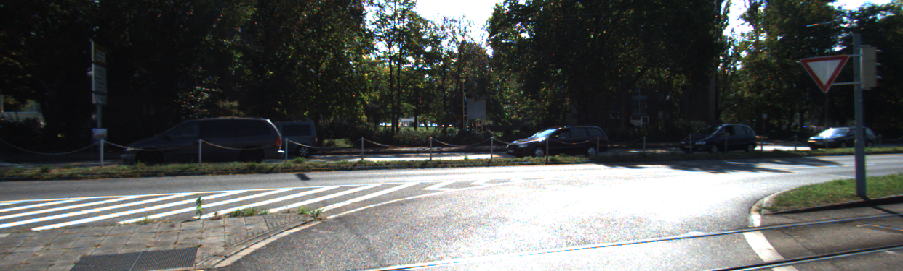

# Smart Monodepth Estimator

This is the PyTorch implementation of depth estimation models using the method described in

> **Digging into Self-Supervised Monocular Depth Prediction**
>
> [Clément Godard](http://www0.cs.ucl.ac.uk/staff/C.Godard/), [Oisin Mac Aodha](http://vision.caltech.edu/~macaodha/), [Michael Firman](http://www.michaelfirman.co.uk) and [Gabriel J. Brostow](http://www0.cs.ucl.ac.uk/staff/g.brostow/)
>
> [ICCV 2019 (arXiv pdf)](https://arxiv.org/abs/1806.01260)

<p align="center">
  
</p>


## ⚙️ Setup

Install the dependencies with:
```shell
pip install -r requirements.txt
```
(Installs numpy, torch, torchvision, urllib, and matplotlib)


## 🖼️ Prediction for a single image

You can predict scaled disparity for a single image with:

```shell
python monodepth.py --image_path assets/test_image.jpg
```
you can also specify the model with --model_name [model]. Options for various models are given below

If you are using a stereo-trained model, you can also estimate metric depth with

```shell
python monodepth.py --image_path assets/test_image.jpg --model_name mono+stereo_640x192 --pred_metric_depth
```

On its first run either of these commands will download the `mono+stereo_640x192` pretrained model (99MB) into the `models/` folder.
We provide the following  options for `--model_name`:

| `--model_name`          | Training modality | Imagenet pretrained? | Model resolution  | KITTI abs. rel. error |  delta < 1.25  |
|-------------------------|-------------------|--------------------------|-----------------|------|----------------|
| [`mono_640x192`](https://storage.googleapis.com/niantic-lon-static/research/monodepth2/mono_640x192.zip)          | Mono              | Yes | 640 x 192                | 0.115                 | 0.877          |
| [`stereo_640x192`](https://storage.googleapis.com/niantic-lon-static/research/monodepth2/stereo_640x192.zip)        | Stereo            | Yes | 640 x 192                | 0.109                 | 0.864          |
| [`mono+stereo_640x192`](https://storage.googleapis.com/niantic-lon-static/research/monodepth2/mono%2Bstereo_640x192.zip)   | Mono + Stereo     | Yes | 640 x 192                | 0.106                 | 0.874          |
| [`mono_1024x320`](https://storage.googleapis.com/niantic-lon-static/research/monodepth2/mono_1024x320.zip)         | Mono              | Yes | 1024 x 320               | 0.115                 | 0.879          |
| [`stereo_1024x320`](https://storage.googleapis.com/niantic-lon-static/research/monodepth2/stereo_1024x320.zip)       | Stereo            | Yes | 1024 x 320               | 0.107                 | 0.874          |
| [`mono+stereo_1024x320`](https://storage.googleapis.com/niantic-lon-static/research/monodepth2/mono%2Bstereo_1024x320.zip)  | Mono + Stereo     | Yes | 1024 x 320               | 0.106                 | 0.876          |
| [`mono_no_pt_640x192`](https://storage.googleapis.com/niantic-lon-static/research/monodepth2/mono_no_pt_640x192.zip)          | Mono              | No | 640 x 192                | 0.132                 | 0.845          |
| [`stereo_no_pt_640x192`](https://storage.googleapis.com/niantic-lon-static/research/monodepth2/stereo_no_pt_640x192.zip)        | Stereo            | No | 640 x 192                | 0.130                 | 0.831          |
| [`mono+stereo_no_pt_640x192`](https://storage.googleapis.com/niantic-lon-static/research/monodepth2/mono%2Bstereo_no_pt_640x192.zip)   | Mono + Stereo     | No | 640 x 192                | 0.127                 | 0.836          |

You can also download models trained on the odometry split with [monocular](https://storage.googleapis.com/niantic-lon-static/research/monodepth2/mono_odom_640x192.zip) and [mono+stereo](https://storage.googleapis.com/niantic-lon-static/research/monodepth2/mono%2Bstereo_odom_640x192.zip) training modalities.

Finally, we provide resnet 50 depth estimation models trained with [ImageNet pretrained weights](https://storage.googleapis.com/niantic-lon-static/research/monodepth2/mono_resnet50_640x192.zip) and [trained from scratch](https://storage.googleapis.com/niantic-lon-static/research/monodepth2/mono_resnet50_no_pt_640x192.zip).
Make sure to set `--num_layers 50` if using these.


## 📦 Precomputed results

You can download our precomputed disparity predictions from the following links:


| Training modality | Input size  | `.npy` filesize | Eigen disparities                                                                             |
|-------------------|-------------|-----------------|-----------------------------------------------------------------------------------------------|
| Mono              | 640 x 192   | 343 MB          | [Download 🔗](https://storage.googleapis.com/niantic-lon-static/research/monodepth2/mono_640x192_eigen.npy)           |
| Stereo            | 640 x 192   | 343 MB          | [Download 🔗](https://storage.googleapis.com/niantic-lon-static/research/monodepth2/stereo_640x192_eigen.npy)         |
| Mono + Stereo     | 640 x 192   | 343 MB          | [Download 🔗](https://storage.googleapis.com/niantic-lon-static/research/monodepth2/mono%2Bstereo_640x192_eigen.npy)  |
| Mono              | 1024 x 320  | 914 MB          | [Download 🔗](https://storage.googleapis.com/niantic-lon-static/research/monodepth2/mono_1024x320_eigen.npy)          |
| Stereo            | 1024 x 320  | 914 MB          | [Download 🔗](https://storage.googleapis.com/niantic-lon-static/research/monodepth2/stereo_1024x320_eigen.npy)        |
| Mono + Stereo     | 1024 x 320  | 914 MB          | [Download 🔗](https://storage.googleapis.com/niantic-lon-static/research/monodepth2/mono%2Bstereo_1024x320_eigen.npy) |

## Example Outputs
<p align="center">
  
</p>
<p align="center">
  
</p>

<p align="center">
  
</p>
<p align="center">
  
</p>

<p align="center">
  
</p>
<p align="center">
  
</p>

<p align="center">
  
</p>
<p align="center">
  
</p>

<p align="center">
  
</p>
<p align="center">
  
</p>

<p align="center">
  
</p>
<p align="center">
  
</p>

<p align="center">
  
</p>
<p align="center">
  
</p>

<p align="center">
  
</p>
<p align="center">
  
</p>

<p align="center">
  
</p>
<p align="center">
  
</p>

<p align="center">
  
</p>
<p align="center">
  
</p>

## Citations
```
@article{monodepth2,
  title     = {Digging into Self-Supervised Monocular Depth Prediction},
  author    = {Cl{\'{e}}ment Godard and
               Oisin {Mac Aodha} and
               Michael Firman and
               Gabriel J. Brostow},
  booktitle = {The International Conference on Computer Vision (ICCV)},
  month = {October},
year = {2019}
}
```